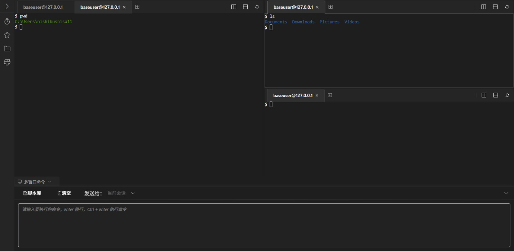
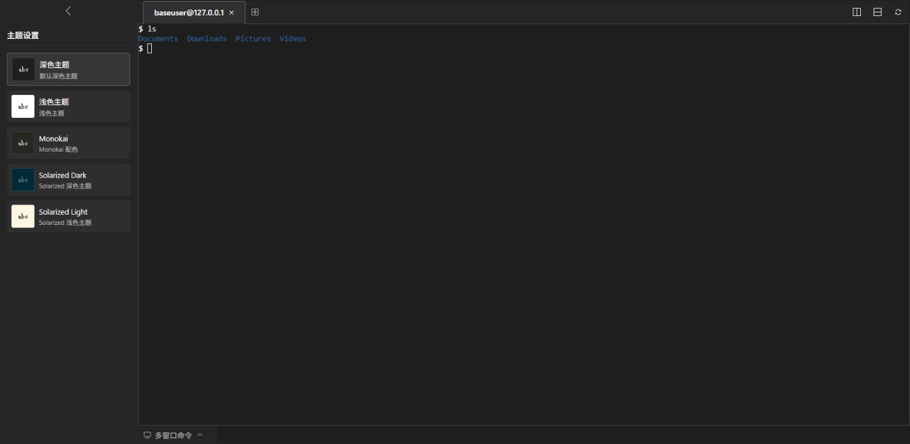
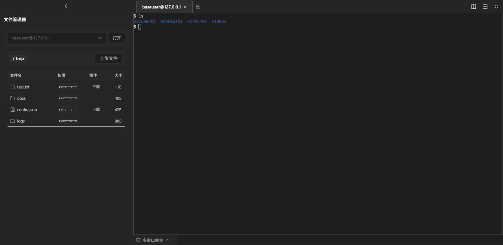

# Terminal-Xterm

[English](#english) | [中文](#中文)







## 中文

一个基于Vue 3和Xterm.js的Web终端Demo，参考一些云服务器厂商的web Terminal，设计了多窗口管理、水平垂直分屏、文件传输和定制主题功能。

🔗 [预览](https://plutda.github.io/terminal-xterm/) (仅前端界面预览，需要本地启动后端服务才能体验完整功能)

## 设计

### 1. 终端管理
- 多终端会话管理
- 终端分屏（水平/垂直），最多4个
- 会话历史记录

### 2. 命令管理
- 多窗口命令同步执行
- 命令历史记录
- 快捷命令（Ctrl+Enter执行）
- 脚本库

### 3. 文件管理
- SFTP文件传输
- 文件上传/下载
- 文件目录浏览

### 4. 主题定制
- 内置多种终端主题
- 自定义主题配色
- 主题实时预览
- 主题持久化保存

### 5. 会话管理
- 会话自动断开（5分钟无活动）
- 会话重连
- 会话权限控制


## 主要依赖

### 前端依赖
```json
{
  "vue": "^3.3.0",
  "xterm": "^5.3.0",
  "xterm-addon-fit": "^0.8.0",
  "xterm-addon-search": "^0.13.0",
  "xterm-addon-web-links": "^0.9.0",
  "element-plus": "^2.4.0",
  "vue-router": "^4.2.0"
}
```

### 后端依赖
```json
{
  "koa": "^2.14.2",
  "koa-router": "^12.0.1",
  "@koa/cors": "^4.0.0",
  "ws": "^8.14.0",
  "ssh2": "^1.15.0",
  "uuid": "^11.1.0"
}
```

## 快速开始

1. 安装依赖
```bash
# 前端
cd frontend
pnpm install

# 后端
cd backend
pnpm install
```

2. 启动开发服务器
```bash
# 前端
cd frontend
pnpm dev

# 后端
cd backend
pnpm dev
```

访问 http://127.0.0.1:8015

## 许可证

[LICENSE](./frontend/LICENSE)

---

## English

A Web Terminal Demo based on Vue 3 and Xterm.js, inspired by cloud service providers' web terminals, featuring multi-window management, horizontal/vertical split screen, file transfer, and theme customization.

🔗 [Live Preview](https://plutda.github.io/terminal-xterm/) (Frontend UI preview only, backend service needs to be started locally for full functionality)

## Features

### 1. Terminal Management
- Multi-terminal session management
- Terminal split screen (horizontal/vertical), up to 4 terminals
- Session history

### 2. Command Management
- Synchronized command execution across multiple windows
- Command history
- Quick command execution (Ctrl+Enter)
- Script library

### 3. File Management
- SFTP file transfer
- File upload/download
- File directory browsing

### 4. Theme Customization
- Multiple built-in terminal themes
- Custom theme colors
- Real-time theme preview
- Theme persistence

### 5. Session Management
- Automatic session disconnect (5 minutes of inactivity)
- Session reconnection
- Session permission control

## Main Dependencies

### Frontend Dependencies
```json
{
  "vue": "^3.3.0",
  "xterm": "^5.3.0",
  "xterm-addon-fit": "^0.8.0",
  "xterm-addon-search": "^0.13.0",
  "xterm-addon-web-links": "^0.9.0",
  "element-plus": "^2.4.0",
  "vue-router": "^4.2.0"
}
```

### Backend Dependencies
```json
{
  "koa": "^2.14.2",
  "koa-router": "^12.0.1",
  "@koa/cors": "^4.0.0",
  "ws": "^8.14.0",
  "ssh2": "^1.15.0",
  "uuid": "^11.1.0"
}
```

## Quick Start

1. Install Dependencies
```bash
# Frontend
cd frontend
pnpm install

# Backend
cd backend
pnpm install
```

2. Start Development Server
```bash
# Frontend
cd frontend
pnpm dev

# Backend
cd backend
pnpm dev
```

visit http://127.0.0.1:8015

## License

[LICENSE](./frontend/LICENSE)